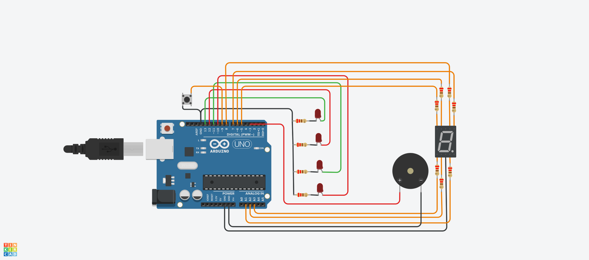

# Estacion de subte


## Alumno:
Carlos Ariel Martinez 1-G

## Consigna:
La empresa  “UTN FRA Robotics” ganó la licitación de un proyecto, y deberá Implementar un sistema que permita al usuario saber a qué estación de subte está llegando, aparte  el sistema muestra las estaciones que faltan hasta llegar a destino, para ello debemos utilizar 4 LEDs y el display de 7 segmentos. Esta vez el buzzer deberá emitir un sonido diferente cada vez que se llegue a una estación.
El sistema deberá arrancar apagado, luego de presionar el botón empezará y hará lo pedido.


## Descripcion:
El presente proyecto simula la llegada a estaciones de subte mediante sonido, tambien indica cuantas estaciones faltan para arribar al destino mediante el display 7 segmentos.

## Funcion Principal:

```c++
void iniciar(){
    for(int x = 0; x < 4; x++){
      switch(x){

        case 0 :
              encenderTres();
              break;
        case 1:
              encenderDos();
              break;
        case 2:
              encenderUno();
              break;
        case 3:
              encenderCero();
        	  x = -1;
              break;
      }
      apagarLeds();
      apagarEstaciones();
      apagarBuzzer();
    }
}
```
Una vez iniciada la simulacion, al accionar el pulsador la funcion iniciar se encarga de llamar a las demas funciones que componen el proyecto. Ésta consta de un ciclo FOR y un SWITCH, cada valor de X corresponde a un caso que ejecuta el encendido del display, un led , un buzzer, indicacion por monitor en serie de la estacion actual y la siguiente y sus correspondientes retardos.


## Link al proyecto en Tinkercad
[Link](https://www.tinkercad.com/things/5dfijhlnMNb-estacion-de-subte/editel)

## Link al codigo completo en GDB Online
[Link](https://onlinegdb.com/MseCTe_lr)
